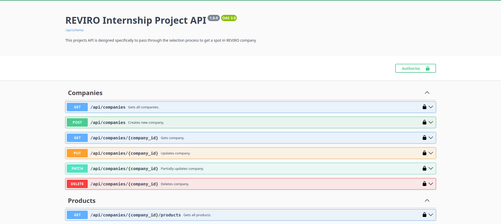
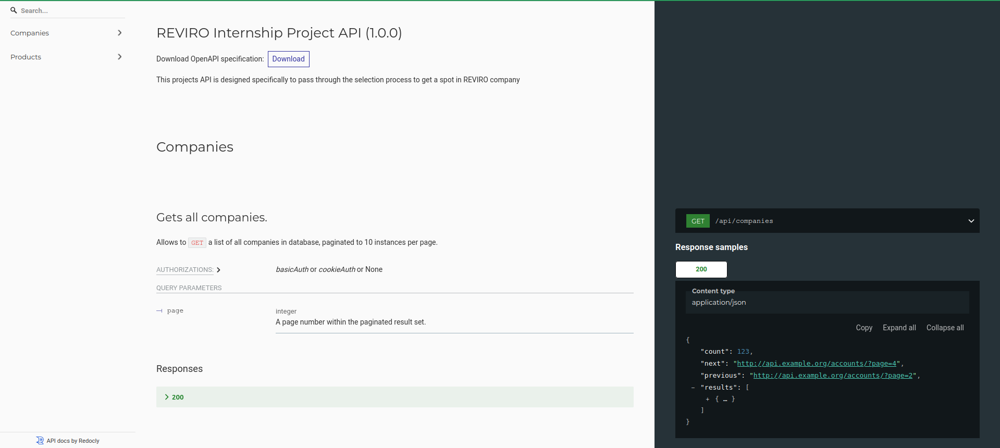

# Инструкции для запуска веб сервера и тестов

> Данный проект был написан для прохождения на стажировку в компанию Reviro и предназначается для модератеров проверяющих работы участников отборочного процесса.

## Первичная установка
1. Откройте терминал.
2. Измените путь к файлу куда вы сохраните проект для тестирования.
3. Клонируйте проект из репозитория с помощью этой команды:

```
git clone https://github.com/eddy-di/reviro_internship
```
4. Вставьте приведенную выше команду в терминал и нажмите Enter.

# Тестирование веб сервера через docker

1. Предполагается что у вас уже установлен Docker.
2. Через терминал перейдите в папку куда вы скопировали проект и введите в команду:

```
docker compose -f compose.web.yaml up -d --build
```

3. Это позволит в виртуальной среде установить все пакеты и запустить проект в docker'e.
4. Проект доступен через браузер по адресу:

```
http://127.0.0.1:8000/
```

Это позволит вам увидеть страницу со статус кодом 404 и информацией. Для того чтобы увидеть swagger-ui документацию эндпоинтов надо будет пройти по этому адресу:

```
http://127.0.0.1:8000/api/swagger-ui
```

Вы увидете такую страницу:


Также доступна версия в redoc:

```
http://127.0.0.1:8000/api/redoc
```

Вы увидете такую страницу:


5. Для того чтобы отключить поднятый сервер в docker'e находясь в папке где был скопирован проект введите следующую команду:

```
docker compose -f compose.web.yaml down -v
```

# Запуск pytest тестов в docker

> Данный образ и контейнеры предназначены для прогона тестов через pytest. Нижеуказанная команда в подпункте 1 реализует сценарий поднятия проекта, запроса команды `pytest -v` и удаления контейнеров проекта. Для корректной работы убедитесь что все другие контейнеры или образы docker не запущены. В случае если порты будут заняты другими проектами то необходимо остановить их.

1. В терминале перейдите в папку где установлен проект и введите следующую команду:

```
docker compose -f compose.test.yaml up -d && docker logs --follow test_web && docker compose -f compose.test.yaml down -v
```

Если вы тестируете через Windows то введите данную команду:

```
docker compose -f compose.test.yaml up -d; docker logs --follow test_web; docker compose -f compose.test.yaml down -v
```

2. После устновки всех пакетов и разворачивания докера вы сможете увидеть успешное выполнение 16 модульных/юнит тестов.
3. Все юнит тесты проверяющие CRUD эндпоинтов по Companies доступны по [этой ссылке](./tests/test_company_api.py).
3. Все юнит тесты проверяющие CRUD эндпоинтов по Products доступны по [этой ссылке](./tests/test_product_api.py).
