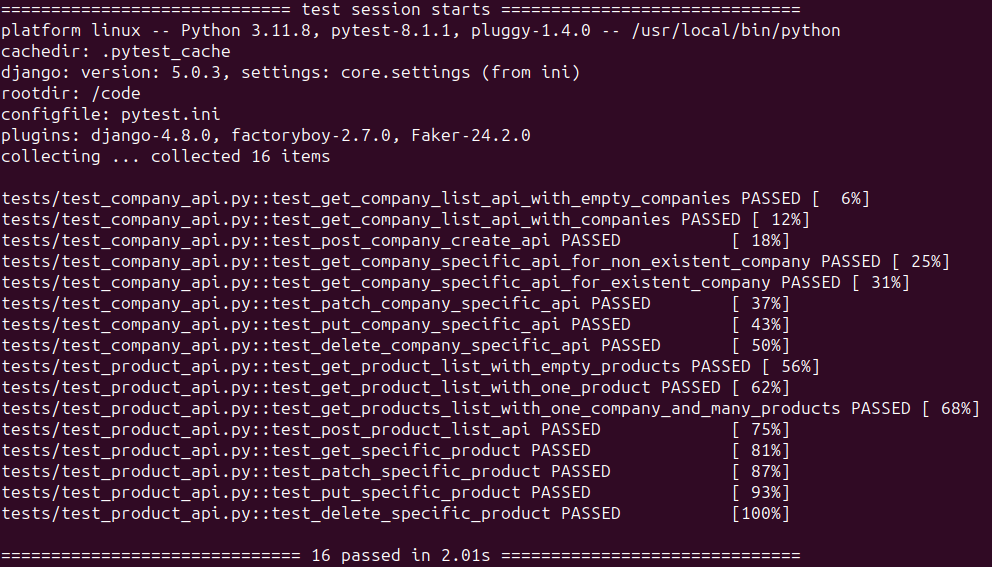

# Обзор проекта

> Данный проект был написан для прохождения на стажировку в компанию Reviro и предназначается для модератеров проверяющих работы участников отборочного процесса.

После прочтения [описания тестового задания](https://docs.google.com/document/d/1u-RQ5KCMiiICpnZUHaKV2IuE_KdX7aShbo3RmY6EpHI/edit) для меня было очевидно что есть две сущности. В моделях для таблиц я определил **предприятия** как *companies* а **продукты** как *products*.
Первичная версия ERD схемы выглядит как показано ниже:


# Инструкции для запуска веб сервера и тестов
## Первичная установка
1. Откройте терминал.
2. Измените путь к файлу куда вы сохраните проект для тестирования.
3. Клонируйте проект из репозитория с помощью этой команды:

```
git clone https://github.com/eddy-di/reviro_internship
```
4. Вставьте приведенную выше команду в терминал и нажмите Enter.

# Тестирование веб сервера через docker

> Для корректной работы убедитесь что все другие контейнеры или образы docker не запущены. В случае если порты будут заняты другими проектами то необходимо остановить их.

1. Предполагается что у вас уже установлен Docker.
2. Через терминал перейдите в папку куда вы скопировали проект и введите в команду:

```
docker compose -f compose.web.yaml up -d --build
```

3. Это позволит в виртуальной среде установить все пакеты и запустить проект в docker'e.
4. Проект доступен через браузер по адресу:

```
http://127.0.0.1:8000/
```

Это позволит вам увидеть страницу со статус кодом 404 и информацией о существующих эндпоинтах. Для того чтобы увидеть swagger-ui документацию эндпоинтов надо будет пройти по этому адресу:

```
http://127.0.0.1:8000/api/v1/swagger-ui
```

Вы увидете такую страницу:


Также доступна версия в redoc:

```
http://127.0.0.1:8000/api/v1/redoc
```

Вы увидете такую страницу:


5. Для того чтобы протестировать через Postman выполните следующие действия:
    1. Предполагается что у вас уже установлен Postman.
    2. Для удобства лучше создать отдельный Workspace, можно увидеть в левом верхнем углу справа от блока меню Home.
    3. В сплывающем меню нажмите на Create Workspace и создайте отдельное пространство для тестов эндпоинтов.
    4. После создания отдельного Workspace находясь в нём нажмите на кнопку Import.
    5. Затем пройдите в директорию куда вы склонировали проект и в папке ./tests/postman вы найдете два json файла с названиями `Reviro_Django.postman_collection.json` и `Reviro_Django.postman_environment.json`.
    6. Импортируйте в свою рабочую среду эти файлы и запустите сценарные тесты.
    7. Вы должны будете увидеть 40 успешно выполненных тестов.

6. Для того чтобы отключить поднятый сервер в docker'e находясь в папке где был скопирован проект введите следующую команду:

```
docker compose -f compose.web.yaml down -v
```

# Запуск pytest тестов в docker

> Данный образ и контейнеры предназначены для прогона тестов через pytest. Нижеуказанная команда в подпункте 1 реализует сценарий поднятия проекта, запроса команды `pytest -v` и удаления контейнеров проекта. Для корректной работы убедитесь что все другие контейнеры или образы docker не запущены. В случае если порты будут заняты другими проектами то необходимо остановить их.

1. В терминале перейдите в папку где установлен проект и введите следующую команду:

```
docker compose -f compose.test.yaml up -d && docker logs --follow test_web && docker compose -f compose.test.yaml down -v
```

Если вы тестируете через Windows то введите данную команду:

```
docker compose -f compose.test.yaml up -d; docker logs --follow test_web; docker compose -f compose.test.yaml down -v
```

2. После установки всех пакетов и разворачивания докера вы сможете увидеть успешное выполнение 24 модульных/юнит тестов.

Конечный результат который вы должны увидеть у себя в терминале должен выглядить как показано ниже:


3. Все юнит тесты проверяющие CRUD эндпоинтов по Companies доступны по [этой ссылке](./tests/test_company_api.py).
3. Все юнит тесты проверяющие CRUD эндпоинтов по Products доступны по [этой ссылке](./tests/test_product_api.py).

# Апдейт
Первоначально не было сказано что нужно делать аутентификацию или прописывать для эндпоинтов разрешения и т.д. Но после того как я запросил в письме надо ли, то получил ответ что нужно сделать всё что получится. На данном этапе получилось реализовать логику JWT token аутентификации при помощи библиотеки djangorestframework-simplejwt. Так как в Джанго встроенная система аутентификации и авторизации потребовалось меньше времени для внедрения JWT аутентификиции. Также присутствуют фильтры чего нет в фастапи версии.

Добавление аутентификации привело к пересмотру тестов через pytest и их количество возросло до 24 из 16 а через Postman возросло до 40 из 32.
